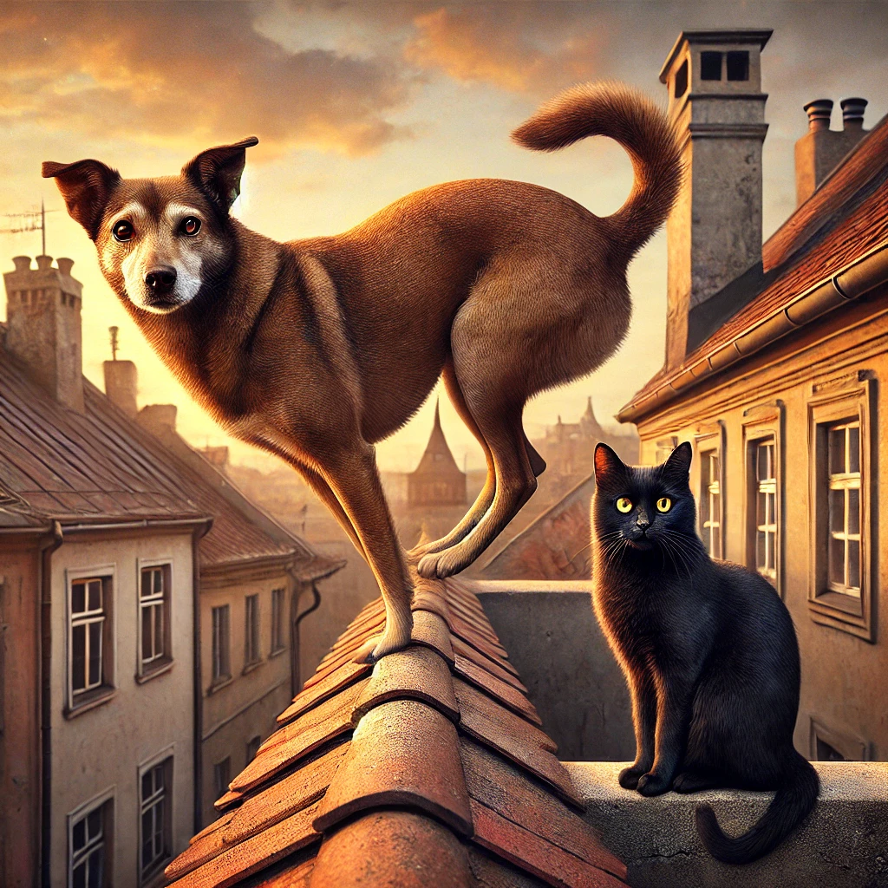

**O Cão que Pensava Ser um Gato** 🐶🐱

No topo de um velho prédio de um bairro movimentado, havia um terraço espaçoso onde um filhote de cão nasceu e cresceu. Chamava-se Nico. Desde pequeno, Nico nunca conheceu o mundo lá embaixo. Seu dono, um senhor idoso e de poucas palavras, criava-o ali, protegido do barulho da cidade, das ruas movimentadas e dos outros cães.

A vida de Nico era solitária, mas não completamente vazia. Todas as tardes, um gato preto de olhos brilhantes saltava do telhado da casa ao lado para visitá-lo. Chamava-se Lino. No começo, Nico ficava desconfiado, mas logo se acostumou à presença do visitante. Lino não se importava em dividir seu tempo com o estranho cão. Juntos, corriam pelo terraço, escalavam pequenas estruturas e observavam o mundo lá de cima.

Com o passar dos meses, Nico começou a imitar os comportamentos de Lino. Pulava para cima das paredes baixas do terraço, equilibrava-se com uma destreza incomum para um cão, e em vez de latir, emitia sons que mais pareciam um miado rouco. O senhor idoso, acostumado às peculiaridades de seu cachorro, ria ao ver aquele cão que se recusava a ser como os outros.

Os vizinhos, no entanto, achavam aquilo estranho. "O cachorro do senhor Amâncio não late, ele mia!", diziam entre cochichos. Alguns tentavam chamá-lo para brincar, mas Nico nunca respondia como um cão normal. Em vez de correr atrás de bolas, ele se espreguiçava ao sol como um gato e caminhava silenciosamente pelo parapeito do terraço, sem nunca perder o equilíbrio.

Um dia, o inesperado aconteceu. O portão da escada que levava ao terraço ficou aberto e Nico, impulsionado por sua curiosidade felina, desceu os degraus e pisou pela primeira vez na rua. O mundo era imenso! Havia cheiros e sons que ele nunca experimentara antes. Mas a maior surpresa veio quando encontrou outros cães.

Um grupo de cachorros se aproximou para cheirá-lo e cumprimentá-lo, abanando o rabo e latindo amistosamente. Nico, confuso, não sabia como reagir. Em vez de responder com latidos, ele soltou um miado estranho e deu um salto para cima de um muro próximo, equilibrando-se com facilidade. Os outros cães se entreolharam e, sem entender nada, foram embora, deixando Nico sozinho.

Lino, que observava tudo de longe, saltou do telhado e se aproximou. O gato preto roçou-se em Nico, como fazia sempre. O cachorro-gato, percebendo que o mundo lá fora era grande demais e que talvez nunca se encaixasse nele, decidiu voltar para o seu terraço. Seu lar não era no chão, mas lá em cima, onde ele podia ser quem quisesse.

E assim, Nico continuou sua vida, correndo pelos muros, saltando sobre telhados e convivendo com Lino. Nunca foi um cão como os outros, mas também nunca quis ser. Para ele, não importava o que os outros pensavam. No seu coração, ele sabia que era um cão. Ou talvez um gato. Ou os dois.

